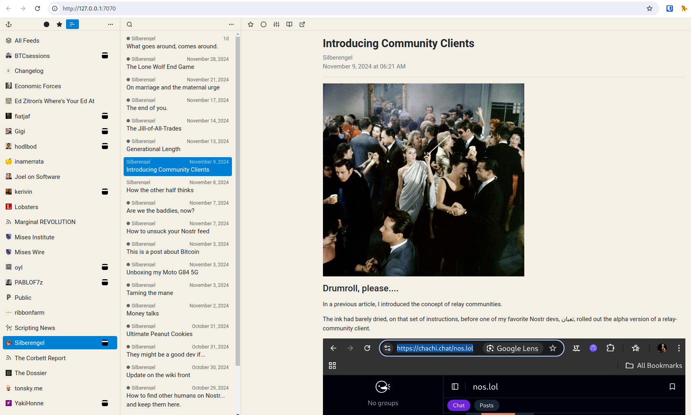

# narr

**narr** (not another rss reader) is a web-based RSS and Nostr long-form feed aggregator
which can be used both as a desktop application and a personal self-hosted server.

The app is a single binary with an embedded database (SQLite).

## usage

The latest prebuilt binaries for Linux/MacOS/Windows AMD64 are available
[here](https://github.com/fiatjaf/narr/releases/latest). Installation instructions:

* MacOS

  Download `narr-*-macos64.zip`, unzip it, place `narr.app` in `/Applications` folder, [open the app][macos-open], click the anchor menu bar icon, select "Open".

* Windows

  Download `narr-*-windows64.zip`, unzip it, open `narr.exe`, click the anchor system tray icon, select "Open".

* Linux

  Download `narr-*-linux64.zip`, unzip it, place `narr` in `$HOME/.local/bin`
and run [the script](etc/install-linux.sh).

[macos-open]: https://support.apple.com/en-gb/guide/mac-help/mh40616/mac

For self-hosting, see `narr -h` for auth, tls & server configuration flags.

See more:

* [Building from source code](doc/build.md)
* [Fever API support](doc/fever.md)

## credits

[Feather](http://feathericons.com/) for icons.
